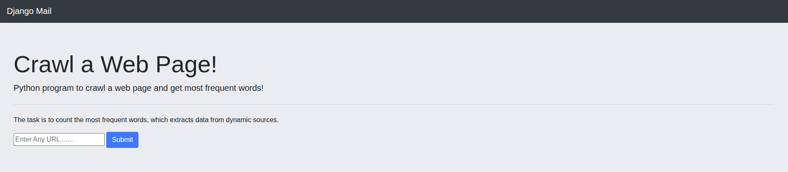
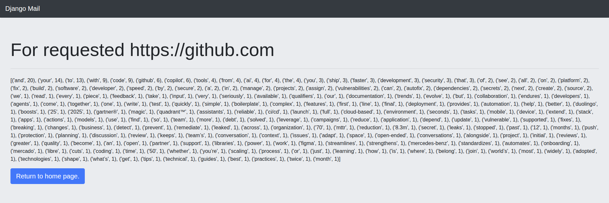

# Project Title

A brief description of what this project does and why it exists.  
For example: *This project is a simple web application that demonstrates input processing and displays results dynamically.*

---

## Project Structure

```
project/
│
├── venv/
├── web_crawler/
├── wordcounter/
├── requirements.txt
└── README.md
```

---

## Features

- Clean and simple user interface
- Processes user input and displays results
- Includes screenshots for reference
- Easy to run locally

---

## Screenshots

### 1. Index Page


### 2. Result Page


---

## Installation

1. Clone the repository:

```bash
git clone https://github.com/X-astro/django-web-crawler.git
cd django-web-crawler
```

2. Install dependencies:

```bash
pip install -r requirements.txt
```

3. Migrate:

```bash
python manage.py migrate
```

4. Run the project:

```bash
python manage.py runserver
```

5. Open your browser and go to:

```
http://127.0.0.1:8000/
```

---

## Usage

- Open the index page
- Input your data or interact with the application
- View the results on the result page

---

## License

This project is licensed under the MIT License.

---

## Contributing

- Fork the repository
- Create a new branch
- Make your changes and submit a pull request
- Pull requests are welcome for bug fixes, enhancements, or improvements

---